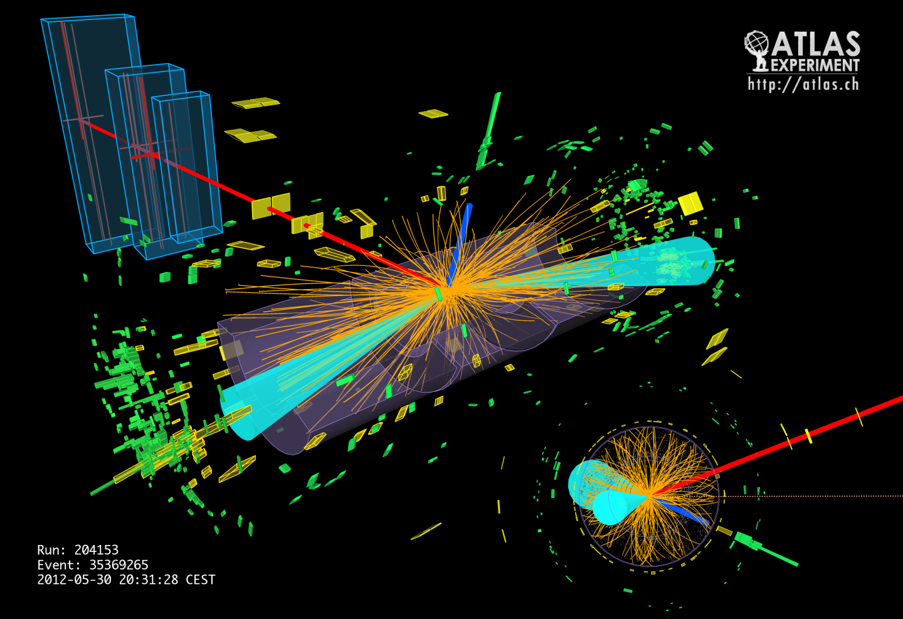
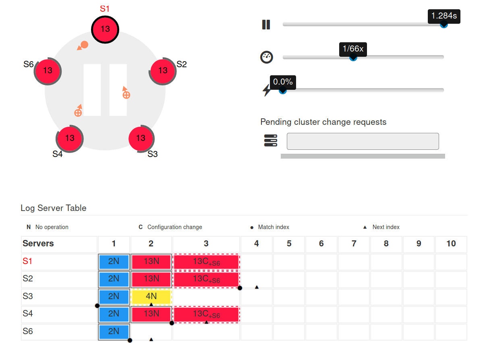
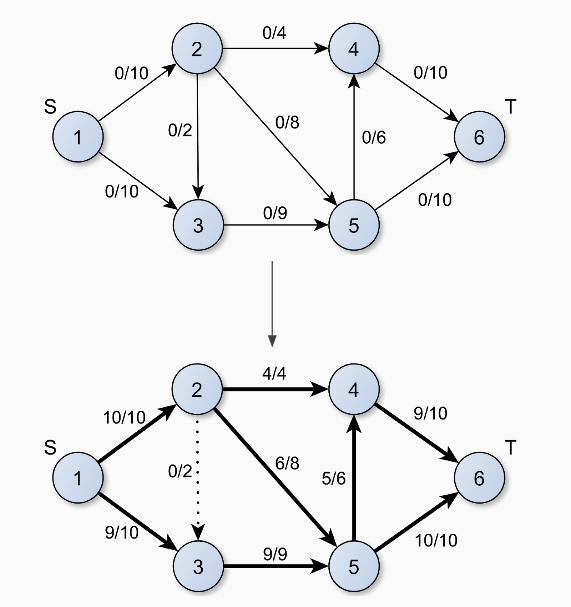

# Hi there!
#### I'm Andrea from Italy.

I am a Data Science master student currently in Stockholm at the Royal Institute of Technology KTH. 
My interests lie in data engineering, machine learning, and distributed systems. The connecting thread in these topics
is my biggest passion which is **algorithms**, whether they are a machine learning model, a distributed consensus protocol
 or a resource allocation/load balancing algorithm.

As of October 19th 2018, I am currently looking for a master's thesis project starting in January 2019. You can get in
 touch with me on [LinkedIn](https://linkedin.com/in/andrea-nardelli) or drop me an email at andnar@kth.se.

### Projects
This page contains a small list of projects that I have worked on during my studies or extracurricular activities that
 are close to my heart.

 * [My BSc thesis](static/pdf/new_physics_detection.pdf) (in English): `New physics detection in High Energy 
 Physics experiments through unsupervised Deep Learning`. I graduated on March 20th 2017 
 with 110 out of 110 cum laude.
 
 * [RaftScope](raftscope): RaftScope is a visualizer of the Raft consensus algorithm. It was originally
 created by Diego Ongaro ([@ongardie](https://github.com/ongardie)). As part of the Distributed Algorithms course at the
 University of Trento I worked with [@MartinBrugnara](https://github.com/MartinBrugnara) and [@FataHoxha](https://github.com/FataHoxha) to
 expand RaftScope with additional functionality as explained in the original PhD dissertation. I believe visualizing
 distributed algorithms in such a way is extremely helpful in teaching them that I decided to contribute to a tool that
 was particularly helpful for me in understanding Raft.
 
 * [pgRouting](https://pgrouting.org/): pgRouting extends the PostGIS / PostgreSQL geospatial database to provide 
 geospatial routing functionality. I worked on adding max-flow and related algorithms to pgRouting as part of my work 
 during [Google Summer of Code 2016](https://summerofcode.withgoogle.com/archive/2016/projects/6192757919973376/), Google's
 global program focused on bringing more student developers into open source software development.
 
 * [WebValley](https://webvalley.fbk.eu/):  WebValley is the summer school for dissemination of interdisciplinary research
 organized by [FBK](https://www.fbk.eu/en/), Italy's top research institute. After being a student in 2013, I find myself coming back to it
 as a mentor for its unique combination of research, learning and fantastic people.
